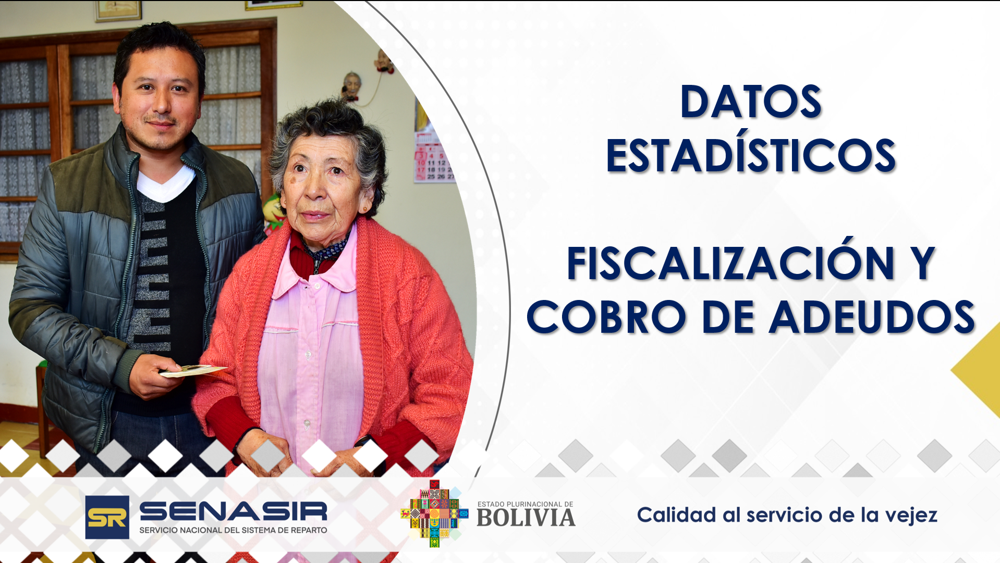

```{r setup, include=FALSE}
library(flexdashboard)
pacman::p_load(
  tidyverse,
  readxl,
  dplyr,
  sparklyr,
  ggplot2,
  plotly,
  DT,
  scales,
  arrow,
  crosstalk,
  shiny,
  htmltools,
  echarts4r,
  kableExtra,
  base64enc,
  knitr
)

source("functions_fc.R",local = TRUE)

data <- join_gestions(dir)

tamano <- consulta(data, type_resp = "tamano")
tipo <- consulta(data, type_resp = "tipo")
comportamiento <- consulta(data, type_resp = "comportamiento")


img_path <- "images/bg.jpeg"  # Ruta de tu imagen
img_base64 <- base64enc::base64encode(img_path)

graf_img <- function(graf){
  div(
  style = sprintf(
    "display: flex; 
    justify-content: center; 
    align-items: center; 
    background-image: url('data:image/png;base64,%s'); 
    background-size: cover; 
    background-repeat: no-repeat; 
    background-position: center; 
    height: 100%%; 
    width: 100%%; 
    overflow: hidden;
    padding: 0; 
    margin: 0;",
    img_base64
  ),
  p(
    style = "padding: 0 5px; margin: 0;",
    graf
    )
)
}

```

# Sistema Reparto {.hidden}

##  {.sidebar}

<a href="#inicio">
    
</a>
[EMPRESAS POR TAMAÑO](#tamano) 
[EMPRESAS POR TIPO](#tipo)
[COMPORTAMIENTO Y MONTO](#comportamiento)

## Row

### 



# Tamano {#tamano .hidden}

## {.sidebar}

<a href="#inicio">
    
</a>
[EMPRESAS POR TAMAÑO](#tamano) 
[EMPRESAS POR TIPO](#tipo)
[COMPORTAMIENTO Y MONTO](#comportamiento) 

## Row {data-height="650" .custom-row}

### NÚMERO DE FISCALIZACIONES A EMPRESAS E INSTITUCIONES (POR TAMAÑO)

```{r}
graf_img(grafica(tamano$bar, with_total = TRUE))
```

## Row 

###  

```{r}
data_table(tamano$table,
           source = 'UFCA',
           other = paste0('Número de población del mes de ', 
                          tamano$month,' de las gestiones ',
                          paste0(tamano$gestions_name,collapse = "-")))
```

# Tipo {#tipo .hidden}

##  {.sidebar}

<a href="#inicio">
    
</a>
[EMPRESAS POR TAMAÑO](#tamano) 
[EMPRESAS POR TIPO](#tipo)
[COMPORTAMIENTO Y MONTO](#comportamiento) 

## Row {data-height="650"}

### NÚMERO DE FISCALIZACIONES A EMPRESAS PRIVADAS E INSTITUCIONES PÚBLICAS

```{r}
graf_img(grafica(tipo$bar, with_total = TRUE))
```

## Row 

### 

```{r}
data_table(tipo$table,
           source = 'UFCA',
           other = paste0('Monto acumulado al mes de ', 
                          tipo$month,' de las gestiones ', 
                          paste0(tipo$gestions_name,collapse = "-")))
```

# Comportamiento {#comportamiento .hidden}

##  {.sidebar}

<a href="#inicio">
    
</a>
[EMPRESAS POR TAMAÑO](#tamano) 
[EMPRESAS POR TIPO](#tipo)
[COMPORTAMIENTO Y MONTO](#comportamiento) 

## Row {data-height="650"}

### COMPORTAMIENTO EN N° DE FISCALIZACIONES  Y MONTO DE RECUPERACIÓN DE APORTES DEVENGADOS A LA SEGURIDAD SOCIAL (Expresado en Millones de Bolivianos)

```{r}
graf_img(grafica(comportamiento$bar, with_total = TRUE))
```

## Row 

### 

```{r}
data_table(comportamiento$table,
           source = 'UFCA',
           other = paste0('Monto acumulado al mes de ', 
                          comportamiento$month, ' de las gestiones ', 
                          paste0(comportamiento$gestion_name,collapse = "-")))
```


