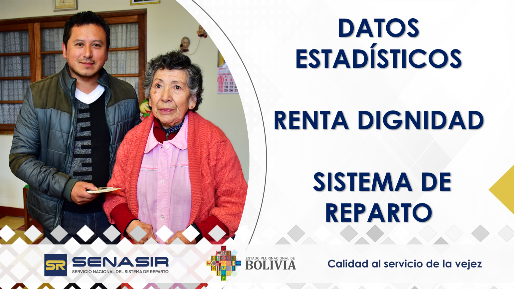

```{r setup, include=FALSE}
library(flexdashboard)
pacman::p_load(
  tidyverse,
  readxl,
  dplyr,
  sparklyr,
  ggplot2,
  plotly,
  DT,
  scales,
  arrow,
  crosstalk,
  shiny,
  htmltools,
  echarts4r,
  kableExtra,
  base64enc,
  knitr
)

source("../functions_rd.R",local = TRUE)

dir <- "../../_data/rd/data"

cc_data <- join_gestions(dir)

cantidad <- reparto(cc_data,filter_clase = "Planilla", 
                     filter_tipo_renta = c("Titular","Derechohabiente"),
                     filter_bd = "Cantidad", type_resp = "n_beneficiarios")

monto <- reparto(cc_data,filter_clase = "Planilla", 
                     filter_tipo_renta = c("Titular","Derechohabiente"),
                     filter_bd = "Monto", type_resp = "m_beneficiarios")

cantMont <- cant_mont(cantidad$bar,monto$bar)

genero <- reparto(cc_data,filter_tipo = c("Titular","Derechohabiente"), 
                     filter_tipo_renta = c("Masculino","Femenino"),
                     filter_bd = "Cantidad", type_resp = "sn_beneficiarios")

num_variables <- nrow(cantidad$bar)

knitr::include_graphics("../images/bg.jpeg")
img_path <- "../images/bg.jpeg"  # Ruta de tu imagen
img_base64 <- base64enc::base64encode(img_path)

graf_img <- function(graf){
  div(
  style = sprintf(
    "display: flex; 
    justify-content: center; 
    align-items: center; 
    background-image: url('data:image/png;base64,%s'); 
    background-size: cover; 
    background-repeat: no-repeat; 
    background-position: center; 
    height: 100%%; 
    width: 100%%; 
    overflow: hidden;",
    img_base64
  ),
  p(graf)
)
}

menu <- c("POBLACIÓN DE RENTISTAS",
          "MONTO DESEMBOLSADO",
          "MONTO VS BENEFICIARIO",
          "N° BENEFICIARIO SEGUN GÉNERO")

titles <- c("N° DE POBLACIÓN DE RENTISTAS TITULARES Y DERECHOHABIENTES DEL SISTEMA DE REPARTO – RENTA DIGNIDAD",
          "MONTO DESEMBOLSADO DE RENTA DIGNIDAD EN EL SISTEMA DE REPARTO (EXPRESADO EN MILLONES DE BOLIVIANOS)",
          "MONTO DESEMBOLSADO Y N° DE BENEFICIARIOS DEL SISTEMA DE REPARTO - RENTA DIGNIDAD",
          "N° DE BENEFICIARIOS DE RENTA DIGNIDAD - SEGÚN EL GÉNERO")

```

#  

## Row

### 



# `r menu[1]`

## Row {data-height=800}

### `r titles[1]`

```{r}
graf_img(graf_titular_derecho(cantidad$bar, with_total = TRUE, var_cant = num_variables))
```

## Row 

### {data-width=650}

```{r}
data_table(cantidad$table,
           source = 'UTI',
           other = paste0('Número de población del mes de ', 
                          monto$month,' de las gestiones ',
                          paste0(cantidad$gestions_names,collapse = "-")))
```

###  {data-width=350}

```{r}
#grafico_pie(cantidad$pie, name_pie = cantidad$month)
grafico_pie(genero$pie, name_pie = monto$month)
```

# `r menu[2]`

## Row {data-height=800}

### `r titles[2]`

```{r}
graf_img(graf_titular_derecho(monto$bar,with_total = TRUE, var_cant = num_variables))
```

## Row 

### {data-width=650}

```{r}
data_table(monto$table,
           source = 'UTI',
           other = paste0('Monto acumulado al mes de ', 
                          monto$month,' de las gestiones ', 
                          paste0(monto$gestions_names,collapse = "-")))
```

###  {data-width=350}

```{r}
grafico_pie(monto$pie, name_pie = monto$month)
```

# `r menu[3]`

Row {data-height=800}
-----------------------------------------------------------------------

### `r titles[3]`

```{r}
graf_img(graf_cantidad_monto(cantMont$bar, var_cant = num_variables))
```

## Row 

### 

```{r}
data_table(cantMont$table,
           source = 'UTI',
           other = paste0('Monto acumulado al mes de ', 
                          monto$month, ' de las gestiones ', 
                          paste0(monto$gestions_names,collapse = "-")))
```

# `r menu[4]`

Row {data-height=800}
-----------------------------------------------------------------------

### `r titles[4]`

```{r}
graf_img(graf_sexo(genero$bar, var_cant = num_variables))
```

## Row

### {data-width=650}

```{r}
data_table(genero$table,
           source = 'UTI',
           other = paste0('Número de población del mes de ', 
                          monto$month, ' de las gestiones', 
                          paste0(genero$gestions_names,collapse = "-")))
```

###  {data-width=350}

```{r}
grafico_pie(genero$pie, name_pie = monto$month)
```